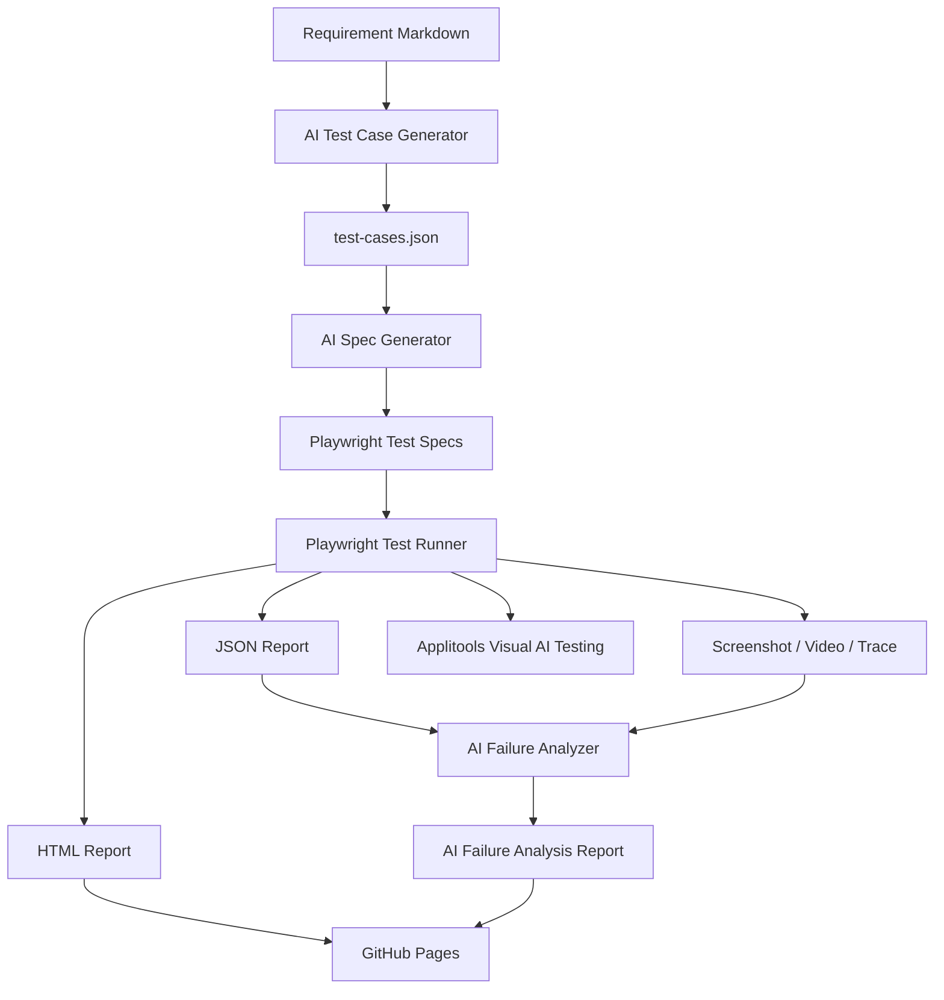
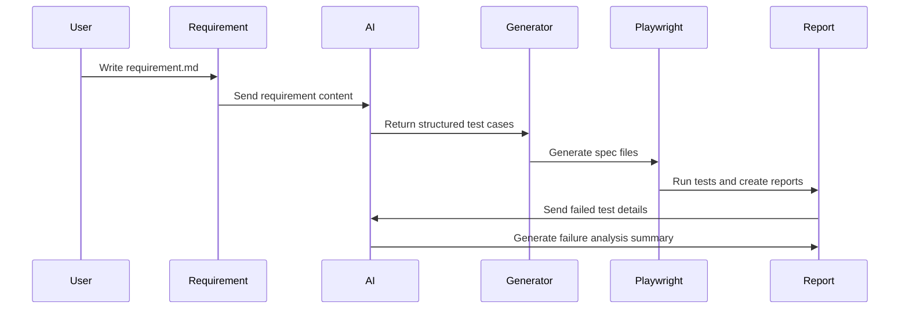

# PROJECT_GENERATION_PROMPT

Create a complete GitHub portfolio-ready project named **AutomateTestPilotAI**.

## Project Name

**AutomateTestPilotAI**

## Product Name

**TestPilot AI**

## Subtitle

AI-Powered Playwright Automation Framework

## Project Overview

AutomateTestPilotAI is a modern web automation testing framework powered by Playwright and AI.
The project demonstrates how AI can help software teams generate test cases from requirements, generate Playwright test scripts, analyze failed tests, and publish automated test reports to GitHub Pages.

This project is designed for a developer portfolio and should look professional for interviewers.

The framework targets these projects:

- `/Users/jakapank/SourceCode/DevPilotAI`
- `/Users/jakapank/SourceCode/CodeReviewPilotAI`
- `/Users/jakapank/SourceCode/JakapanKPortfolio`

## Main Goals

Build a production-ready demo framework that includes:

1. Automated web testing using Playwright
2. AI-generated test cases from requirement files
3. AI-generated Playwright test specs
4. AI failure analysis report
5. Visual AI testing with Applitools Eyes
6. Multi-project target configuration
7. GitHub Actions CI/CD pipeline
8. GitHub Pages report deployment
9. Clean architecture and documentation
10. MIT License
11. Professional README with diagrams and flow

## Tech Stack

- TypeScript
- Playwright
- OpenAI API or Azure OpenAI
- Applitools Eyes
- Node.js
- GitHub Actions
- GitHub Pages
- Markdown reports
- JSON reports
- HTML reports

## Architecture Diagram



## Test Generation Flow



## Required Folder Structure

```text
AutomateTestPilotAI/
├─ requirements/
│  └─ login.requirement.md
├─ src/
│  ├─ ai/
│  │  ├─ generateTestCases.ts
│  │  ├─ generateSpec.ts
│  │  ├─ analyzeFailure.ts
│  │  └─ openAiClient.ts
│  ├─ config/
│  │  └─ projects.ts
│  ├─ pages/
│  │  ├─ LoginPage.ts
│  │  └─ DashboardPage.ts
│  ├─ utils/
│  │  ├─ env.ts
│  │  ├─ fileHelper.ts
│  │  └─ buildReportSite.ts
│  └─ types/
│     └─ testCase.ts
├─ tests/
│  ├─ generated/
│  ├─ login.spec.ts
│  └─ visual/
│     └─ login.visual.spec.ts
├─ reports/
│  ├─ test-cases.json
│  └─ ai-failure-analysis.md
├─ .github/
│  └─ workflows/
│     ├─ ci.yml
│     └─ pages.yml
├─ public/
│  └─ index.html
├─ playwright.config.ts
├─ package.json
├─ tsconfig.json
├─ .env.example
├─ .gitignore
├─ PROJECT_GENERATION_PROMPT.md
├─ README.md
└─ LICENSE
```

## Functional Requirements

### 1. AI Test Case Generator

Create `src/ai/generateTestCases.ts`.

It must:

- Read all `.md` files from `requirements/`
- Send requirement content to OpenAI API or Azure OpenAI when configured
- Generate structured test cases
- Save output to `reports/test-cases.json`
- Use mock test cases when no AI key exists

Each test case must include:

```ts
{
  id: string;
  title: string;
  description: string;
  priority: "High" | "Medium" | "Low";
  preconditions: string[];
  steps: string[];
  expectedResult: string;
  testType: "UI" | "API" | "Visual" | "E2E";
  tags: string[];
}
```

### 2. AI Playwright Spec Generator

Create `src/ai/generateSpec.ts`.

It must:

- Read `reports/test-cases.json`
- Generate Playwright spec files under `tests/generated/`
- Use Playwright best practices:
  - `getByRole`
  - `getByLabel`
  - `getByTestId`
  - `expect`
  - no hard-coded sleep
  - reusable Page Object Model

### 3. AI Failure Analyzer

Create `src/ai/analyzeFailure.ts`.

It must:

- Read Playwright JSON report
- Detect failed tests
- Collect test title, error message, stack trace, artifacts, and retry count
- Send failure details to AI when configured
- Generate `reports/ai-failure-analysis.md`
- Use deterministic local analysis when no AI key exists

The AI report must include:

```text
Summary
Root Cause
Failed Step
Possible Fix
Affected File
Risk Level
Recommended Next Action
```

### 4. Multi-Project Targeting

Create `src/config/projects.ts`.

Support:

- `devpilotai`
- `codereviewpilotai`
- `portfolio`

Use `TARGET_PROJECT` and `BASE_URL` to run against different apps.

### 5. Page Object Model

Create:

- `src/pages/LoginPage.ts`
- `src/pages/DashboardPage.ts`

Use clean TypeScript classes.

### 6. Sample Manual Tests

Create:

- `tests/login.spec.ts`

Test scenarios:

- Home page should load
- Primary navigation should be discoverable
- Login page should load
- Login with valid credentials
- Show error for invalid credentials
- Logout successfully

Auth tests should be opt-in with `RUN_AUTH_TESTS=true`.

### 7. Visual AI Testing

Create:

- `tests/visual/login.visual.spec.ts`

Requirements:

- Read `APPLITOOLS_API_KEY` from environment variable
- Do not hardcode secrets
- Add visual checkpoint for login page
- Add visual checkpoint for dashboard or home page
- Skip visual tests when the API key is missing

### 8. Playwright Configuration

Create `playwright.config.ts`.

Configure:

- Chromium
- Firefox
- WebKit
- `baseURL` from `BASE_URL`
- screenshot on failure
- video retain on failure
- trace retain on failure
- HTML report
- JSON report
- retries in CI
- parallel execution

### 9. Environment Variables

Create `.env.example`:

```env
BASE_URL=https://example.com
TARGET_PROJECT=portfolio
OPENAI_API_KEY=
OPENAI_MODEL=gpt-4.1-mini
AZURE_OPENAI_ENDPOINT=
AZURE_OPENAI_API_KEY=
AZURE_OPENAI_DEPLOYMENT=
AZURE_OPENAI_API_VERSION=2024-10-21
APPLITOOLS_API_KEY=
DEV_PILOT_AI_URL=http://localhost:3000
CODE_REVIEW_PILOT_AI_URL=http://localhost:3001
PORTFOLIO_URL=http://localhost:3002
```

### 10. CI/CD with GitHub Actions

Create `.github/workflows/ci.yml`.

The workflow must:

- Run on push and pull request
- Install dependencies
- Install Playwright browsers
- Type check
- Generate test cases
- Generate Playwright specs
- Run Playwright tests
- Run AI failure analysis even if tests fail
- Build static report site
- Upload reports as artifacts

### 11. GitHub Pages Deployment

Create `.github/workflows/pages.yml`.

The workflow must:

- Run after CI
- Download CI report artifacts
- Deploy `public/` to GitHub Pages

GitHub Pages output should include:

```text
public/
├─ index.html
├─ playwright-report/
├─ ai-failure-analysis.md
└─ test-cases.json
```

### 12. Report Landing Page

Create `public/index.html`.

It should show:

- Project title: AutomateTestPilotAI
- Links to:
  - Playwright HTML Report
  - AI Failure Analysis
  - Generated Test Cases
- Short project overview
- GitHub repository link placeholder

### 13. README.md

Create a professional README.md with:

- Project title
- Badges
- Project overview
- Features
- Tech stack
- Architecture diagram
- Test generation flow
- Folder structure
- Setup guide
- Environment variables
- How to run locally
- How to generate test cases
- How to generate specs
- How to run tests
- How to run visual AI tests
- GitHub Actions CI/CD explanation
- GitHub Pages deployment guide
- Interview talking points
- Future improvements

## Scripts in package.json

```json
{
  "scripts": {
    "test": "playwright test",
    "test:ui": "playwright test --ui",
    "test:headed": "playwright test --headed",
    "test:report": "playwright show-report",
    "test:project": "tsx src/cli/runProject.ts",
    "test:portfolio": "tsx src/cli/runProject.ts portfolio",
    "test:devpilot": "tsx src/cli/runProject.ts devpilotai",
    "test:codereview": "tsx src/cli/runProject.ts codereviewpilotai",
    "ai:generate-cases": "tsx src/ai/generateTestCases.ts",
    "ai:generate-specs": "tsx src/ai/generateSpec.ts",
    "ai:analyze-failure": "tsx src/ai/analyzeFailure.ts",
    "report:site": "tsx src/utils/buildReportSite.ts",
    "test:visual": "playwright test tests/visual",
    "check": "tsc --noEmit"
  }
}
```

## License

Create `LICENSE` using MIT License.

Use this copyright:

```text
Copyright (c) 2026 Jakapan Kanta
```

## Repository Name

Use this repository name:

```text
AutomateTestPilotAI
```

## GitHub Pages URL Format

Mention in README:

```text
https://Ligerking007.github.io/AutomateTestPilotAI/
```

## Important Coding Rules

- Code must be clean and readable
- Use TypeScript strict mode
- Do not hardcode API keys
- Use environment variables
- Add error handling
- Add useful console logs
- Make it easy to run locally
- Make it safe for public GitHub
- Mock AI response if no API key exists
- Keep the project suitable for a developer portfolio

## Expected Final Output

Generate the complete project with all files needed to run:

```bash
npm install
npx playwright install
npm run ai:generate-cases
npm run ai:generate-specs
npm test
npm run ai:analyze-failure
npm run report:site
```

The project should be ready to push to GitHub and deploy reports to GitHub Pages.
