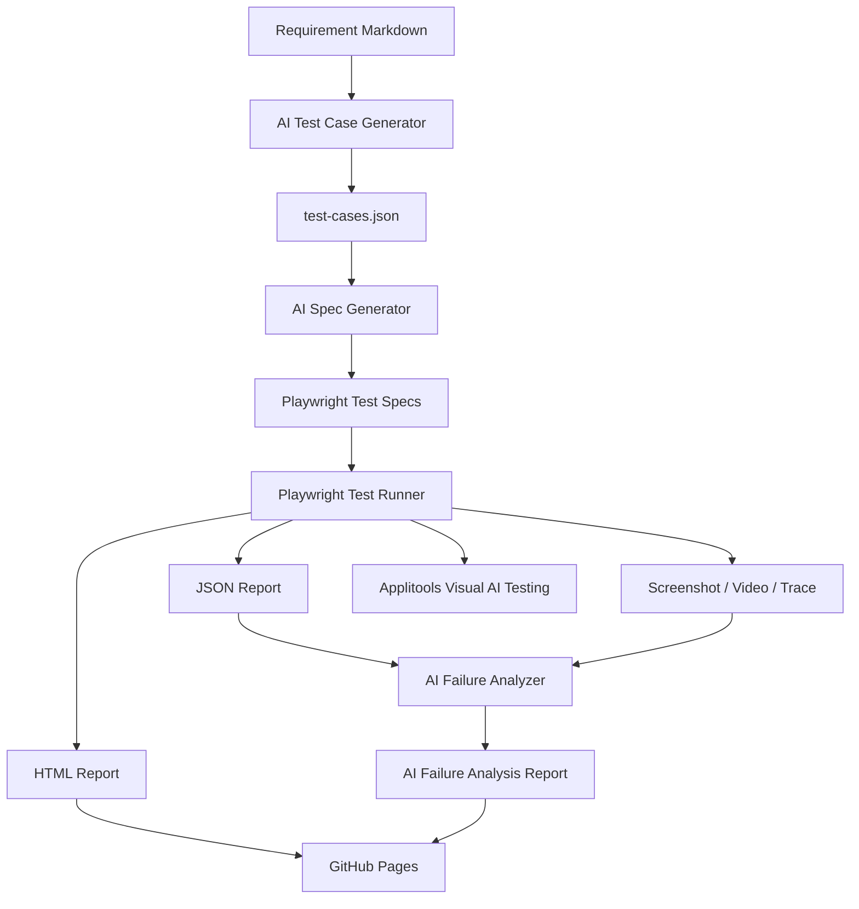
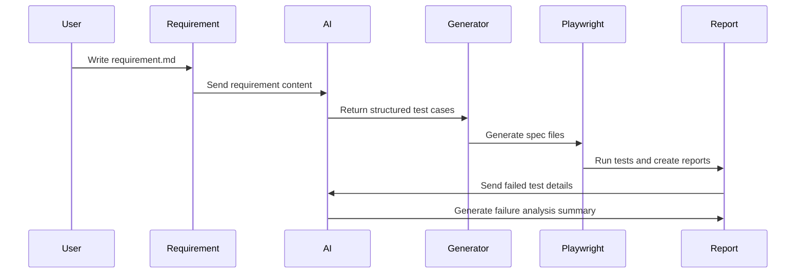

# AutomateTestPilotAI

[](https://github.com/Ligerking007/AutomateTestPilotAI/actions/workflows/ci.yml)
[](https://github.com/Ligerking007/AutomateTestPilotAI/actions/workflows/pages.yml)

AI-powered Playwright automation framework for generating test cases from requirements, generating Playwright specs, running cross-browser tests, analyzing failures, and publishing reports to GitHub Pages.

This project is designed as a portfolio-ready automation framework for these projects:

- `/Users/jakapank/SourceCode/DevPilotAI`
- `/Users/jakapank/SourceCode/CodeReviewPilotAI`
- `/Users/jakapank/SourceCode/JakapanKPortfolio`

## Feature Highlights

- AI test case generation from markdown requirements
- AI Playwright spec generation from structured JSON test cases
- AI failure analysis with root cause, failed step, risk level, and next action
- Deterministic mock AI fallback when no API key is configured
- Multi-project target config for DevPilotAI, CodeReviewPilotAI, and portfolio
- Cross-browser Playwright execution for Chromium, Firefox, and WebKit
- Page Object Model with strict TypeScript
- Screenshot, video, and trace artifacts on failure
- Optional Applitools Eyes visual AI testing
- GitHub Actions CI with report artifacts
- GitHub Pages report landing page

## Tech Stack

- TypeScript
- Node.js
- Playwright
- OpenAI API or Azure OpenAI
- Applitools Eyes
- GitHub Actions
- GitHub Pages
- Markdown, JSON, and responsive HTML/CSS reports

No extra frontend framework is required for the report UI. The dashboard and test case editor are static HTML/CSS/JavaScript pages so they can be deployed directly to GitHub Pages with a small bundle and no client-side build step.

## Architecture



## Test Generation Flow



## Folder Structure

```text
AutomateTestPilotAI/
├─ requirements/
├─ src/
│  ├─ ai/
│  ├─ config/
│  ├─ pages/
│  ├─ types/
│  └─ utils/
├─ tests/
│  ├─ unit/
│  ├─ generated/
│  └─ visual/
├─ reports/
├─ public/
├─ .github/workflows/
├─ playwright.config.ts
├─ package.json
└─ README.md
```

## Setup

```bash
npm install
npx playwright install
cp .env.example .env
```

Set the target app:

```env
TARGET_PROJECT=portfolio
BASE_URL=http://localhost:3002
```

Supported `TARGET_PROJECT` values:

- `devpilotai`
- `codereviewpilotai`
- `portfolio`

## Environment Variables

```env
BASE_URL=https://example.com
TARGET_PROJECT=portfolio

OPENAI_API_KEY=
OPENAI_MODEL=gpt-4.1-mini

AZURE_OPENAI_ENDPOINT=
AZURE_OPENAI_API_KEY=
AZURE_OPENAI_DEPLOYMENT=
AZURE_OPENAI_API_VERSION=2024-10-21

APPLITOOLS_API_KEY=
```

If no OpenAI or Azure OpenAI credentials are present, the framework uses mock AI responses so it can still be demonstrated locally and in public CI.

## Commands

```bash
npm run ai:generate-cases
npm run ai:generate-specs
npm run test:unit
npm test
npm run ai:analyze-failure
npm run report:site
npm run ui:local
```

## AI Workflow

### 1. AI Test Case Generator

`src/ai/generateTestCases.ts` reads every markdown file from `requirements/`, sends the requirement content to OpenAI or Azure OpenAI, and writes structured test cases to `reports/test-cases.json`.

Each generated test case includes `id`, `title`, `description`, `priority`, `preconditions`, `steps`, `expectedResult`, `testType`, and `tags`.

### 2. AI Playwright Spec Generator

`src/ai/generateSpec.ts` reads `reports/test-cases.json`, asks AI to generate a Playwright TypeScript spec, validates that the output uses Playwright imports and assertions, blocks hard-coded sleeps, and saves the result under `tests/generated/`.

When no AI key is available, it falls back to a deterministic generator so the project still works in public demos.

### 3. AI Failure Analyzer

`src/ai/analyzeFailure.ts` reads the Playwright JSON report, detects failed tests, collects error details and artifacts, sends the failure summary to AI, and writes `reports/ai-failure-analysis.md`.

The report includes Summary, Root Cause, Failed Step, Possible Fix, Affected File, Risk Level, and Recommended Next Action.

## Unit Tests

Unit tests use the Node.js built-in test runner with `tsx`, so no extra test framework is required.

```bash
npm run test:unit
```

Current unit coverage focuses on the project logic that should stay stable:

- AI spec prompt building, markdown fence cleanup, fallback spec generation, and blocked hard-coded sleeps
- Manual test case merge and validation rules
- Target project lookup and unknown project errors
- File helper behavior for JSON/text writes, markdown discovery, and optional copy operations

CI runs unit tests after TypeScript checking and before generating AI test cases or running Playwright browser tests.

## Local Command Center

The project includes a local-only UI for running common npm scripts and viewing command output from the browser.

```bash
npm run ui:local
```

Open:

```text
http://127.0.0.1:4174
```

The command center runs on your machine, not on GitHub Pages. It intentionally uses a whitelist instead of accepting arbitrary shell commands. Available actions include:

- Type check
- Unit tests
- Generate AI test cases
- Merge manual test cases
- Generate Playwright specs
- Run Playwright tests
- Analyze failures
- Build report site
- Run the full target project pipeline

Use the Project, Browser, BASE_URL, and `--test-only` controls to run the same workflow you would normally run from the terminal.

## Manual Test Cases

The report site includes a manual test case UI:

```text
public/manual-test-cases.html
```

Use it to load generated JSON, load manual JSON, search and select test cases by title, create/edit cases in a form, import external JSON, and export the updated file without editing JSON by hand. Exported manual cases should be saved to:

```text
reports/manual-test-cases.json
```

Merge manual cases into the generated test case file:

```bash
npm run manual:merge
npm run ai:generate-specs
```

The full project runner also merges manual cases automatically before generating specs:

```bash
npm run test:project -- portfolio
```

The report UI includes responsive layouts, centered shared navigation, English/Thai language switching, and light/dark theme switching. Preferences are stored in browser local storage, so the selected language and theme persist across the dashboard and manual test case pages.

Other useful commands:

```bash
npm run test:ui
npm run test:headed
npm run test:report
npm run test:visual
npm run test:unit
npm run ui:local
npm run check
```

## Select Target Project

Run the full AI automation pipeline against a specific project:

```bash
npm run test:project -- portfolio
npm run test:project -- devpilotai
npm run test:project -- codereviewpilotai
```

Shortcut commands:

```bash
npm run test:portfolio
npm run test:devpilot
npm run test:codereview
```

The project runner loads `src/config/projects.ts`, sets `TARGET_PROJECT` and `BASE_URL`, generates test cases, generates specs, runs Playwright, analyzes failures, and rebuilds the report site.

Use `--test-only` when generated test cases/specs are already up to date:

```bash
npm run test:project -- portfolio --test-only
```

Run one browser while debugging locally:

```bash
npm run test:project -- portfolio --test-only --browser=chromium
```

Override the URL when the target app runs on a different port:

```bash
BASE_URL=http://localhost:3005 npm run test:project -- portfolio
```

## GitHub Actions

The CI workflow runs on push and pull request:

1. Install dependencies
2. Install Playwright browsers
3. Type check
4. Run unit tests
5. Generate test cases
6. Generate Playwright specs
7. Run Playwright tests
8. Run AI failure analysis even when tests fail
9. Build the static report site
10. Upload reports as artifacts

## GitHub Pages

Reports are published from `public/`.

Expected URL:

```text
https://Ligerking007.github.io/AutomateTestPilotAI/
```

Published files:

```text
public/
├─ index.html
├─ playwright-report/
├─ ai-failure-analysis.md
└─ test-cases.json
```

## Interview Talking Points

- This is a framework, not only a collection of tests.
- Requirements are the source of truth, and AI converts them into structured test cases.
- Generated specs follow Playwright practices and are separated from hand-written smoke tests.
- The system has graceful degradation: it works without AI credentials through mock responses.
- CI preserves debugging artifacts and runs failure analysis even when tests fail.
- Visual AI testing is included as an optional professional-grade regression layer.
- Multi-project targeting makes the framework reusable across personal projects.

## Future Improvements

- Add requirement traceability matrix
- Add per-project fixture files and auth storage state
- Add API testing with Playwright request fixtures
- Add Slack or Discord notification for failed builds
- Add trend dashboard for flaky tests and failure categories
